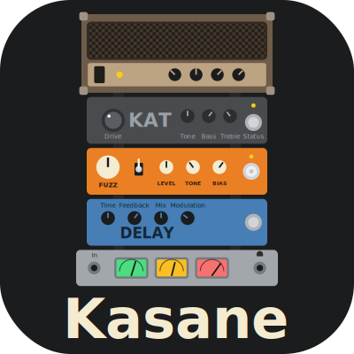
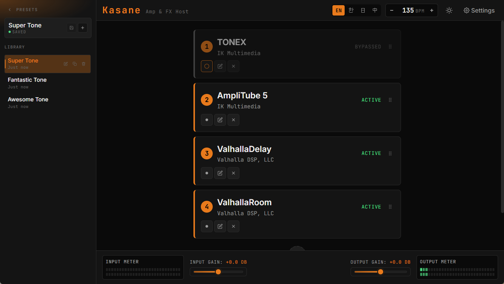

<div align="center">
  
</div>

# Kasane

> A fast, lightweight guitar amp and FX plugin host for instant playing without a DAW.



Kasane is a lightweight Windows app for guitar players who want to hear their sound immediately without opening a full DAW.

Most DAWs are built around recording and production. Kasane is built around one question first:

**how quickly can you get from plugging in your guitar to hearing your tone?**

If your usual flow is:

- turn on the interface
- wait for a DAW to boot
- create or load a project
- set monitoring again
- add amp sim and pedals again

Kasane is for the shorter path.

## Features

- Standalone guitar amp and effects host for Windows
- VST3 amp sim and effect hosting
- Fast audio device setup
- Input/output gain control and live meters
- Drag-and-drop plug-in chain
- Native plug-in editor windows
- English, Korean, Japanese, and Simplified Chinese UI

Kasane is not trying to be a DAW, recorder, or multitrack production tool.

## Installation

Download `Kasane.exe` from the [Releases](https://github.com/frogbam/kasane/releases/latest) page.

<details>
  <summary>Building from source</summary>

What you need:

- Microsoft Edge WebView2 Runtime
- CMake 3.22+
- Visual Studio 2022 or compatible MSVC toolchain
- Node.js 20+ and npm

```powershell
cmake -S . -B build
cmake --build build --config Release
```

After a successful Release build:

```text
build/kasane_artefacts/Release/Kasane.exe
```

</details>

## About the Name
Kasane comes from the Japanese word 重ね (kasane), meaning “layering” or “stacking.”

The name reflects the way Kasane is meant to be used: building a playable guitar sound by stacking amp sims and effects into a simple signal chain.


## License

Kasane is licensed under `AGPL-3.0-only`.

Kasane uses a number of third-party libraries, SDKs, and runtimes that carry their own licenses and terms:

- The native application and audio host are built on JUCE 8, which is dual-licensed under the AGPLv3 and the commercial JUCE license.
- The VST3 SDK, bundled through JUCE, is licensed under the MIT license by Steinberg Media Technologies GmbH.
- WebView2 is used to host the desktop UI. The Microsoft WebView2 SDK and runtime are subject to Microsoft's license and distribution terms.
- ASIO support is enabled in this project through JUCE. The relevant ASIO code remains subject to the Steinberg ASIO license terms distributed with JUCE.
- The frontend uses Preact, `@preact/signals`, and Vite, which are licensed under the MIT license.
- Kasane bundles the Inter and JetBrains Mono fonts, both licensed under the SIL Open Font License 1.1.
- TypeScript is licensed under the Apache License 2.0.
- User-installed audio plug-ins are not part of Kasane and remain subject to their own licenses.

VST is a trademark of Steinberg Media Technologies GmbH.

See [LICENSE](./LICENSE) for the full license text.
See [THIRD_PARTY_NOTICES.md](./THIRD_PARTY_NOTICES.md) for bundled third-party notices.
